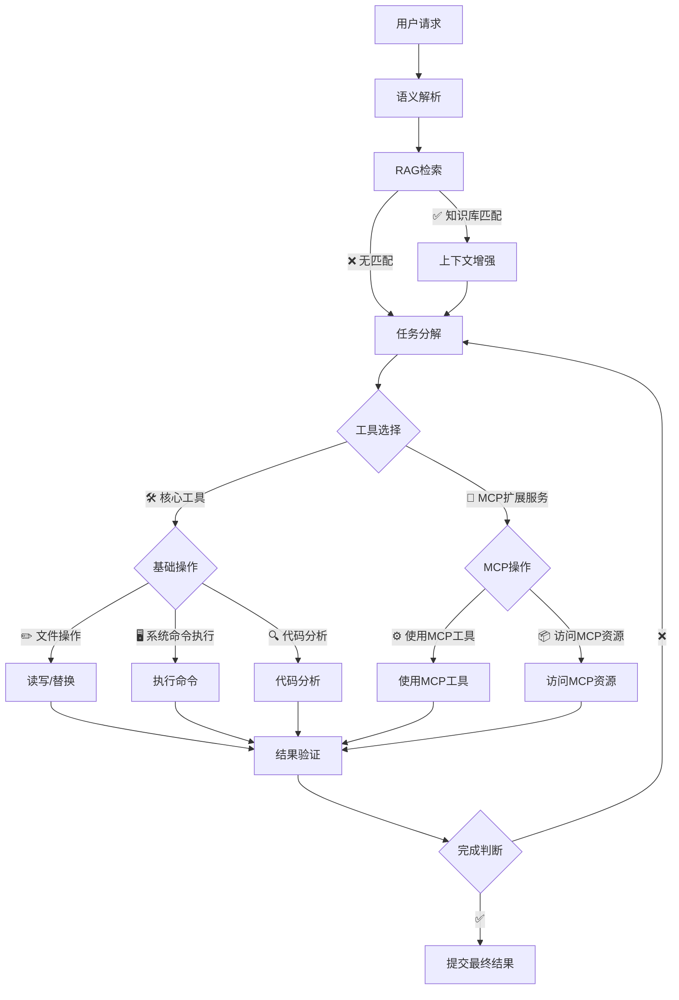
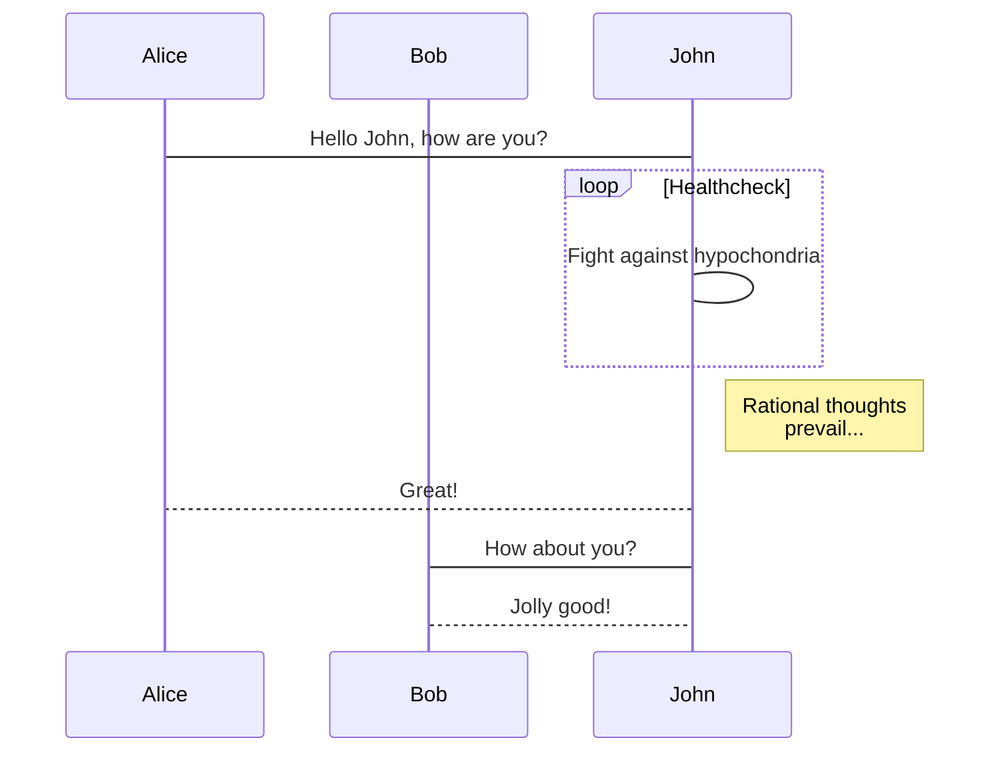
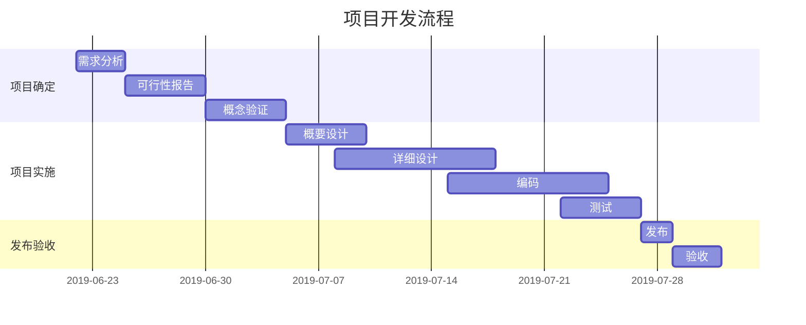

> 📍 引言（可选）：一句话说明文章动机或背景。

<!--more-->

## 一、章节标题示例
---
这里是正文内容，用 Markdown 编写。
[Arya](https://markdown.lovejade.cn/?ref=markdown.lovejade.cn)
---
###
**微注**
- 使用 `##`、`###` 生成目录；
- 可插入图片：  
  ``
  ``
- 可加引用：
  > “重拾写作，重建秩序。”
---
### 二、代码块

```bash
bundle exec jekyll serve
```
---
### 三、高效绘制——[流程图]


---

### 5. 高效绘制[序列图](https://github.com/knsv/mermaid#sequence-diagram)



---

### 6. 高效绘制[甘特图](https://github.com/knsv/mermaid#gantt-diagram)

> **甘特图**内在思想简单。基本是一条线条图，横轴表示时间，纵轴表示活动（项目），线条表示在整个期间上计划和实际的活动完成情况。它直观地表明任务计划在什么时候进行，及实际进展与计划要求的对比。



### 7. 支持图表

```echarts
{
  "backgroundColor": "#212121",
  "title": {
    "text": "「晚晴幽草轩」访问来源",
    "subtext": "2019 年 6 月份",
    "x": "center",
    "textStyle": {
      "color": "#f2f2f2"
    }
  },
  "tooltip": {
    "trigger": "item",
    "formatter": "{a} <br/>{b} : {c} ({d}%)"
  },
  "legend": {
    "orient": "vertical",
    "left": "left",
    "data": [
      "搜索引擎",
      "直接访问",
      "推荐",
      "其他",
      "社交平台"
    ],
    "textStyle": {
      "color": "#f2f2f2"
    }
  },
  "series": [
    {
      "name": "访问来源",
      "type": "pie",
      "radius": "55%",
      "center": [
        "50%",
        "60%"
      ],
      "data": [
        {
          "value": 10440,
          "name": "搜索引擎",
          "itemStyle": {
            "color": "#ef4136"
          }
        },
        {
          "value": 4770,
          "name": "直接访问"
        },
        {
          "value": 2430,
          "name": "推荐"
        },
        {
          "value": 342,
          "name": "其他"
        },
        {
          "value": 18,
          "name": "社交平台"
        }
      ],
      "itemStyle": {
        "emphasis": {
          "shadowBlur": 10,
          "shadowOffsetX": 0,
          "shadowColor": "rgba(0, 0, 0, 0.5)"
        }
      }
    }
  ]
}
```

> **备注**：上述 echarts 图表📈，其数据，须使用严格的 **JSON** 格式；您可使用 JSON.stringify(data)，将对象传换从而得标准数据，即可正常使用。

---

### 8. 绘制表格

| 作品名称        | 在线地址   |  上线日期  |
| :--------  | :-----  | :----:  |
| 逍遥自在轩 | [https://niceshare.site](https://niceshare.site/?ref=markdown.lovejade.cn) |2024-04-26|
| 玉桃文飨轩 | [https://share.lovejade.cn](https://share.lovejade.cn/?ref=markdown.lovejade.cn) |2022-08-26|
| 缘知随心庭 | [https://fine.niceshare.site](https://fine.niceshare.site/?ref=markdown.lovejade.cn) |2022-02-26|
| 静轩之别苑 | [http://quickapp.lovejade.cn](http://quickapp.lovejade.cn/?ref=markdown.lovejade.cn) |2019-01-12|
| 晚晴幽草轩 | [https://www.jeffjade.com](https://www.jeffjade.com/?ref=markdown.lovejade.cn) |2014-09-20|
